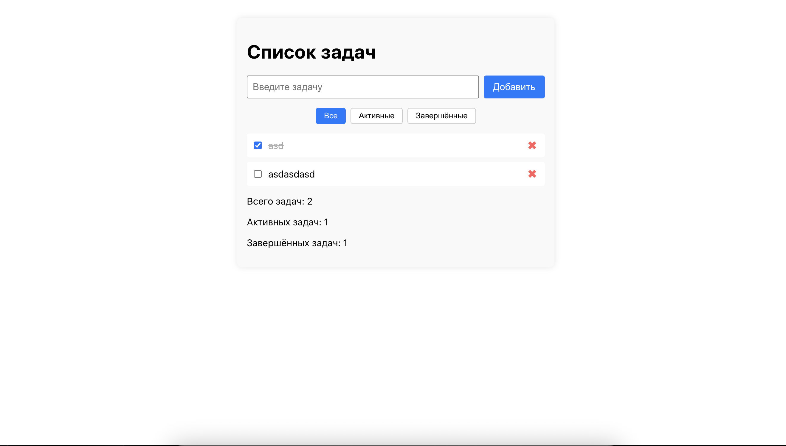

# 📝 React ToDo App

A minimal and clean ToDo app built with React.

## ✨ Features

- Add and delete tasks
- Mark tasks as completed
- Filter tasks by status (All, Active, Completed)
- Persistent data with localStorage
- Clean component-based structure
- Responsive and simple UI

## 🧪 Tech Stack

- React (with hooks)
- JavaScript
- HTML + CSS (inline styles)
- Vercel for deployment

## 🚀 Demo

👉 [Open live app](https://react-todo-app-gamma-self.vercel.app/)  
👉 [View source code](https://github.com/KChakhalyan/react-todo-app)

## 📷 Screenshot

